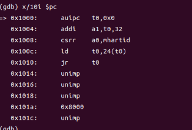
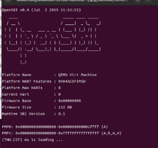
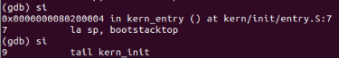
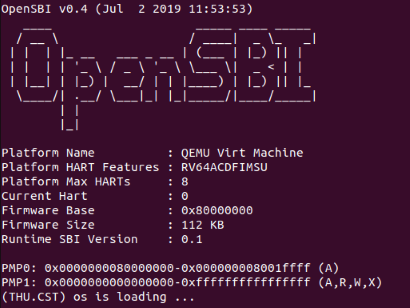
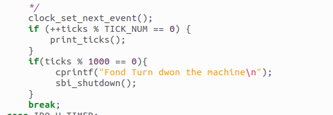
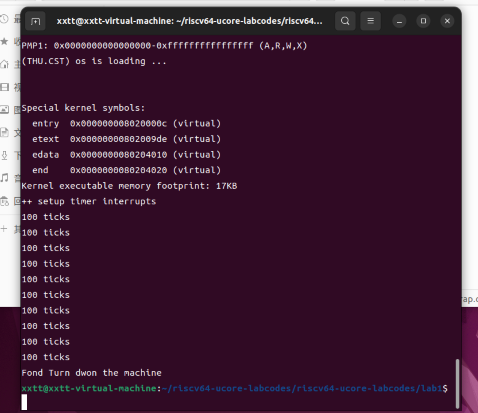
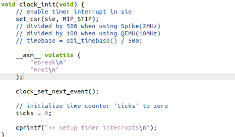
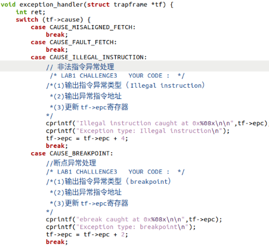
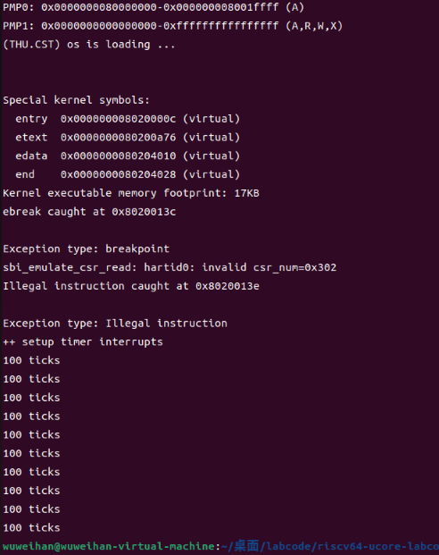

---
author:
- 吴维翰  李晓彤  杨昕怡
bibliography:
- 'Ref/Collection.bib'
title: 'lab0.5+lab1'
---

1em

lab0.5
======

Problem1 RISC-V硬件加电后的几条指令位置
---------------------------------------

auipc t0, 0x0 ：将当前 PC 寄存器的高 20 位加上立即数
0x0，然后将结果存储在寄存器 t0 中。此时 t0 是 0x1000。

addi a1, t0, 32 ：它将寄存器 t0 中的值加 32，然后将结果存储在寄存器 a1
中。

csrr a0 ： mhartid，用于读取控制和状态寄存器中 mhartid
寄存器的值(当前硬件线程的ID号)，并将结果存储在寄存器 a0 （此时值为 0）。

ld t0 ：24(t0)，从内存地址 t0 + 24 读取一个 64
位的数据，并将数据储存在t0 中。此时 t0 的值是 0x80000000。

jr t0 ：跳转到t0储存的目标地址中。

当CPU开始执行内核第一条指令时，控制权会传递给内核，接管计算机的控制，进行操作系统初始化。

{width="10cm"}

la  sp, bootstacktop :栈指针寄存器（sp）的值设置为bootstacktop
标签所代表的地址。这可以用于初始化栈指针，以确保程序在执行时能够正确地使用栈空间。

tail  kern\_init:告诉编译器在执行 kern\_init 结束后不要生成 ret 指令

当程序执行完 tail  kern\_init 后，正式开始内核初始化。首先是执行 memset
函数，初始化内存区域，内存区域的起始地址和结束地址在 $kern.ld$
中已经定义，最后格式化输出我们想要现实的信息 (THU.CST) os is loading
\... ,
输出完毕，执行下一条指令，跳转自身地址，系统进入死循环。最后页面如下图所示。

lab1
====

练习1：理解内核启动中的程序入口操作
-----------------------------------

1.la  sp,
bootstacktop指的是将bootstacktop的地址赋值给sp，目的是初始化内核栈，为栈分配空间。

2.tail  kern\_init
其中，tail是RISC-V的一条伪指令，其作用是尾调用远端子过程，也就是对kern\_init进行尾调用，目的是进入操作系统的入口。

练习2：完善中断处理
-------------------

函数填充部分如下：

首先，我们调用clock \_ set \_ next
\_event函数来设置下一次时钟中断时间，为当前时间+100000。

ticks不断自增，每触发100个时钟中断，就输出一行100ticks到控制台上。

当打印10行信息后，调用sbi\_ shutdown()函数进行关机。

运行示例如下：

当发生时钟中断时，CPU会跳转到stvec保存的地址中继续执行指令，也就是真正的中断入口点\_\_
alltraps,接着执行save\_
all保存上下文操作，将sp的地址保存到a0当中，a0寄存器传参数给接下来要调用的函数trap，然后跳转执行trap函数。

在trap\_dispatch函数中，经过判断证明该trap是由于中断引起的，进入interrupt\_handler()函数，根据cause匹配至IRQ\_S\_TIMER处继续执行，完成上述操作。

challenge1:描述与理解中断流程
-----------------------------

1.当发生中断时，CPU会跳转到stvec中保存的地址继续执行命令，在这里也就是我们真正的中断入口\_\_
alltraps，接着执行save\_
all保存上下文操作，将sp的地址保存到a0当中，a0寄存器传参数给接下来要调用的函数trap，然后跳转执行trap函数。

在trap\_dispatch函数中，通过判断证明该trap是中断还是异常，判断完成后分别进入interrupt\_handler()函数或exception\_handler（）函数，再根据cause匹配到不同的代码段继续执行相应程序。

2.mov  
a0，sp是将sp的地址保存到a0当中。在RISC-V通用寄存器中，a0-a7用于储存函数参数，规定函数的第一个参数由寄存器a0进行传递，在这里通过a0将参数传入trap函数中。

3.SAVE\_ ALL中寄存器保存在栈中的位置是由addi sp, sp, -36 \*
REGBYTES指令预先分配栈帧来确定的。

4.对于任何中断，\_\_alltraps
中不是都需要保存所有寄存器。在恢复上下文的代码中，我们可以看到在恢复现场的时候，对于控制状态寄存器的四个寄存器status,epc,badaddr,cause我们只恢复了其中的status和epc寄存器。这主要是因为badaddr寄存器和cause寄存器中保存的分别是出错的地址以及出错的原因，当我们处理完这个中断的时候，也就不需要这两个寄存器中保存的值，所以可以不用恢复这两个寄存器。

challenge2：理解上下文切换机制
------------------------------

1、csrw  sscratch, sp; 是将当前栈顶指针传递给sscratch，csrrw  s0,
sscratch,
x0是将sscratch的值传给s0，再将sscratch置0。由于sscratch寄存器规定：若在中断之前处于U态(用户态)，保存的是内核栈地址；否则中断之前处于S态(内核态)，保存的是0，这样做可以在发生异常时，可以确定该中断处于内核态。

2、这主要是因为badaddr寄存器和cause寄存器中保存的分别是出错的地址以及出错的原因，当我们处理完这个中断的时候，也就不需要这两个寄存器中保存的值，所以可以不用恢复这两个寄存器。但trap函数需要读取这些寄存器作为它的参数，所以需要进行保存。

Challenge3：完善异常中断
------------------------

修改代码如下：

\centering

运行结果如下：

实验中的重点知识
----------------

1、中断可以分为如下几种情况：

异常(Exception)，指在执行一条指令的过程中发生了错误，此时我们通过中断来处理错误。最常见的异常包括：访问无效内存地址、执行非法指令(除零)、发生缺页等。他们有的可以恢复(如缺页)，有的不可恢复(如除零)，只能终止程序执行。

陷入(Trap)，指我们主动通过一条指令停下来，并跳转到处理函数。常见的形式有通过ecall进行系统调用(syscall)，或通过ebreak进入断点(breakpoint)。

外部中断(Interrupt)，简称中断，指的是 CPU
的执行过程被外设发来的信号打断，此时我们必须先停下来对该外设进行处理。典型的有定时器倒计时结束、串口收到数据等。

外部中断是异步(asynchronous)的，CPU 并不知道外部中断将何时发生。CPU
也并不需要一直在原地等着外部中断的发生，而是执行代码，有了外部中断才去处理。我们知道，CPU
的主频远高于 I/O 设备，这样避免了 CPU 资源的浪费。

由于中断处理需要进行较高权限的操作，中断处理程序一般处于内核态，或者说，处于"比被打断的程序更高的特权级"。注意，在RISCV里，中断(interrupt)和异常(exception)统称为\"trap\"。

2、除了32个通用寄存器之外，RISCV架构还有大量的控制状态寄存器 Control and
Status Registers(CSRs)。其中有几个重要的寄存器和中断机制有关。

例如：sstatus寄存器(Supervisor Status
Register)里面有一个二进制位SIE(supervisor interrupt
enable，在RISCV标准里是21
对应的二进制位)，数值为0的时候，如果当程序在S态运行，将禁用全部中断。（对于在U态运行的程序，SIE这个二进制位的数值没有任何意义），sstatus还有一个二进制位UIE(user
interrupt enable)可以在置零的时候禁止用户态程序产生中断。

stvec(Supervisor Trap Vector Base Address
Register)，即所谓的"中断向量表基址"。中断向量表的作用就是把不同种类的中断映射到对应的中断处理程序。如果只有一个中断处理程序，那么可以让stvec直接指向那个中断处理程序的地址。

对于RISCV架构，stvec会把最低位的两个二进制位用来编码一个"模式"，如果是"00"就说明更高的SXLEN-2个二进制位存储的是唯一的中断处理程序的地址(SXLEN是stval寄存器的位数)，如果是"01"说明更高的SXLEN-2个二进制位存储的是中断向量表基址，通过不同的异常原因来索引中断向量表。但是怎样用62个二进制位编码一个64位的地址？RISCV架构要求这个地址是四字节对齐的，总是在较高的62位后补两个0。

sepc(supervisor exception program
counter)，它会记录触发中断的那条指令的地址；

scause，它会记录中断发生的原因，还会记录该中断是不是一个外部中断；

stval，它会记录一些中断处理所需要的辅助信息，比如指令获取(instruction
fetch)、访存、缺页异常，它会把发生问题的目标地址或者出错的指令记录下来。

3、用汇编实现上下文切换(context switch)机制包含两步：

保存CPU的寄存器（上下文）到内存中（栈上）

从内存中（栈上）恢复CPU的寄存器

OS原理重点
----------

1.进程调度算法相关知识，本次实验并没有设计进程调度，比如先来先服务，轮转法，最短作业优先等算法，决定进程在系统中的执行顺序

2.内存管理策略相关知识，操作系统需要实施内存分配和回收策略，例如首次适应，最佳适应等，能够有效地管理内存资源

3.文件系统，本次实验没有涉及文件的创建，读取，写入和删除操作

4.系统调用和用户空间，内核空间之间的切换以及网络通信
